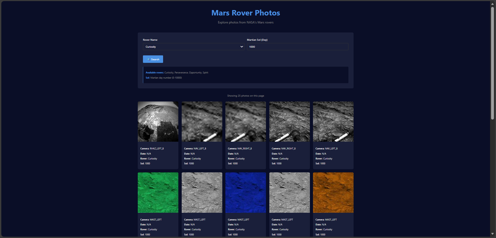

# Mars Explorer

**Mars Explorer** is a Single Page Application (SPA) for browsing NASA Mars rover photos. The project is built with **vanilla TypeScript** using a custom component-based architecture and client-side routing without any frameworks. This project demonstrates API integration, state management, routing, and building scalable SPA architecture.


---

## ✨ Features

### 📸 Photo Gallery
- **View NASA Mars rover photos**
- **Supported rovers**: Curiosity, Perseverance, Opportunity, Spirit
- **Open full-resolution images** in a new tab
- **Detailed photo page** with complete information

### 🔍 Search and Filtering
- **Select Mars rover**
- **Search by Martian Sol (day)**
- **Input validation (Sol: 0–10,000)**

### 📄 Pagination
- **25 photos per page**
- **Previous / Next navigation**
- **Auto-scroll to top**
- **Disabled buttons at boundaries**

### 🚨 State Handling
- **Loading indicator**
- **Clear error messages**
- **404 page for unknown routes**

### 🎨 User Interface
- **Responsive design**
- **Clean and minimalist layout**
- **Reusable UI components**

---

## 🛠 Technology Stack

- **TypeScript** — strict typing
- **Vite** — dev server and build tool
- **Vanilla CSS** — no CSS frameworks
- **Lodash (template)** — HTML templating
- **NASA Mars Rover Photos API** — data source (via proxy)

---

## 🚀 Getting Started

### 🔧 Prerequisites

- Node.js version **16+**
- npm or yarn

### 📦 Installation and Running

Clone the repository, install dependencies, and start the project:

```bash
git clone <repository-url>
cd mars-explorer
npm install
npm run dev
```

Open in browser: `http://localhost:5173`

### ⚙️ Environment Variables

Create a `.env` file in the project root:

```env
VITE_API_BASE_URL=https://alem.school/mars/api/v1
VITE_API_KEY=
```

### 🏗 Build and Preview

**Build for production:**
```bash
npm run build
```

**Preview production build:**
```bash
npm run preview
```

**Lint code:**
```bash
npm run lint
```

---

## 📁 Project Structure

```
mars-explorer/
├── src/
│   ├── api/
│   │   └── marsApi.ts              # NASA API integration
│   ├── components/
│   │   ├── Button.ts               # Button component
│   │   ├── Input.ts                # Input field component
│   │   ├── Select.ts               # Select dropdown component
│   │   └── MarsPhotoCard.ts        # Photo card component
│   ├── core/
│   │   ├── BaseComponent.ts        # Base component class
│   │   └── Router.ts               # Client-side router
│   ├── pages/
│   │   ├── PageMarsRoverSearch.ts  # Main search page
│   │   ├── PagePhotoDetail.ts      # Photo detail page
│   │   └── PageNotFound.ts         # 404 page
│   ├── styles/
│   │   └── main.css                # Global styles
│   ├── types/
│   │   └── mars.ts                 # TypeScript types
│   ├── main.ts                     # Entry point
│   └── env.d.ts                    # Environment variable types
├── index.html                      # HTML entry point
├── README.md                       # Project documentation
├── .env                            # Environment variables
├── .gitignore                      # Git ignore rules
├── package.json                    # npm configuration and dependencies
├── tsconfig.json                   # TypeScript configuration
└── .eslintrc.json                  # ESLint configuration
```

---

## 🏗 Architecture

### 🧱 Component-Based Architecture

**BaseComponent** — base class for all components with:
- **Props** — input data (immutable)
- **State** — local component state
- **setState** — state update with re-rendering
- **Lifecycle hooks** — component lifecycle management
- **Event cleanup** — prevent memory leaks

**Component Hierarchy:**
```
BaseComponent
├── Button
├── Input
├── Select
├── MarsPhotoCard
└── Pages
    ├── PageMarsRoverSearch
    ├── PagePhotoDetail
    └── PageNotFound
```

### 🧭 Client-Side Routing

- `/` — main search page
- `/photo/:id` — photo detail page
- `*` — 404 page for unknown routes

**Router Features:**
- Hash-based routing
- Dynamic route parameters
- Route guards
- Programmatic navigation

### 🌐 API Integration

**Base URL:** `https://alem.school/mars`

**Main Endpoint:**
```
GET /api/v1/rovers/{rover}/photos?sol={sol}&page={page}
```

**Query Parameters:**
- `rover` — rover name (curiosity, perseverance, opportunity, spirit)
- `sol` — Martian day (0–10,000)
- `page` — page number (default: 1)

**Response Format:**
```json
{
  "photos": [
    {
      "id": 102693,
      "sol": 1000,
      "camera": {
        "name": "FHAZ",
        "full_name": "Front Hazard Avoidance Camera"
      },
      "img_src": "http://mars.jpl.nasa.gov/...",
      "earth_date": "2015-05-30",
      "rover": {
        "name": "Curiosity",
        "landing_date": "2012-08-06",
        "launch_date": "2011-11-26",
        "status": "active"
      }
    }
  ]
}
```

### 🚀 Supported Rovers

| Rover | Status | Launch Date | Landing Date |
|-------|--------|-------------|--------------|
| Curiosity | Active | 2011-11-26 | 2012-08-06 |
| Perseverance | Active | 2020-07-30 | 2021-02-18 |
| Opportunity | Inactive | 2003-07-07 | 2004-01-25 |
| Spirit | Inactive | 2003-06-10 | 2004-01-04 |

---

## 🎓 Learning Outcomes

This project demonstrates:

- **TypeScript** — type-safe development
- **Component Architecture** — reusable UI components
- **State Management** — local component state
- **Client-Side Routing** — SPA navigation
- **API Integration** — fetching and displaying data
- **Error Handling** — graceful error states
- **Template Engine** — Lodash templates
- **Build Tools** — Vite configuration
- **Code Quality** — ESLint, clean code practices

---

## 📝 Code Examples

### Creating a Component

```typescript
import BaseComponent from './core/BaseComponent';

interface ButtonProps {
  text: string;
  onClick: () => void;
}

interface ButtonState {
  disabled: boolean;
}

class Button extends BaseComponent<ButtonProps, ButtonState> {
  constructor(props: ButtonProps) {
    super('button', props, { disabled: false });
  }

  render(): string {
    return `
      <button 
        class="btn" 
        ${this.state.disabled ? 'disabled' : ''}
      >
        ${this.props.text}
      </button>
    `;
  }

  componentDidMount(): void {
    this.element?.addEventListener('click', this.handleClick);
  }

  componentWillUnmount(): void {
    this.element?.removeEventListener('click', this.handleClick);
  }

  private handleClick = (): void => {
    if (!this.state.disabled) {
      this.props.onClick();
    }
  };
}
```

### API Integration

```typescript
const fetchPhotos = async (
  rover: string,
  sol: number,
  page: number = 1
): Promise<MarsPhoto[]> => {
  const url = `${import.meta.env.VITE_API_BASE_URL}/rovers/${rover}/photos?sol=${sol}&page=${page}`;
  
  const response = await fetch(url);
  
  if (!response.ok) {
    throw new Error('Failed to fetch photos');
  }
  
  const data = await response.json();
  return data.photos;
};
```

---

## 🧪 Testing

Run ESLint to check code quality:
```bash
npm run lint
```

**Linting Rules:**
- `"semi": "error"` — semicolons required
- `"no-console": "error"` — no console statements
- `"no-unused-vars": "error"` — no unused variables
- `"no-var": "error"` — use const/let instead of var
- `"no-undef": "error"` — no undefined variables

---

## 🚧 Constraints & Requirements

### ✅ Allowed
- TypeScript
- Lodash (template only)
- Vite/Parcel
- Vanilla CSS

### ❌ Not Allowed
- No React, Vue, Angular
- No jQuery
- No CSS frameworks (Bootstrap, Tailwind)
- No external API keys in code

### 📋 Requirements
- ✅ No console errors
- ✅ All ESLint rules pass
- ✅ No UI crashes
- ✅ Proper event cleanup
- ✅ Environment variables in `.env`
- ✅ TypeScript strict mode

---

## 🔮 Future Improvements

- [ ] Add photo favorites functionality
- [ ] Implement photo search by camera type
- [ ] Add date range filtering
- [ ] Create photo comparison feature
- [ ] Implement dark mode
- [ ] Add unit tests
- [ ] Optimize image loading with lazy loading
- [ ] Add accessibility improvements (ARIA labels)

---

## 📝 License

This project is part of an educational curriculum.

---

## 👤 Author

- 📧 Email: [makasheva003@mail.ru]
- 🌐 GitHub: [@aimakashe](https://github.com/aimakashe)

---

## 🙏 Acknowledgments

- **NASA** — for providing the Mars Rover Photos API
- **Alem School** — for the API proxy service
- Educational curriculum project


# Mars Explorer

**Mars Explorer** — это одностраничное веб-приложение (SPA) для просмотра фотографий марсоходов NASA. Проект реализован на **vanilla TypeScript** с кастомной компонентной архитектурой и клиентским роутингом без использования фреймворков. Проект демонстрирует работу с API, управление состоянием, маршрутизацию и построение масштабируемой архитектуры SPA.

---

## ✨ Возможности

### 📸 Работа с фотографиями
- **Просмотр фотографий марсоходов NASA**
- **Поддержка роверов**: Curiosity, Perseverance, Opportunity, Spirit
- **Открытие фото в полном разрешении** в новой вкладке
- **Детальная страница фотографии**

### 🔍 Поиск и фильтрация
- **Выбор марсохода**
- **Поиск по марсианскому дню (Sol)**
- **Валидация ввода (Sol: 0–10000)**

### 📄 Пагинация
- **25 фотографий на страницу**
- **Навигация Previous / Next**
- **Автоматическая прокрутка вверх**
- **Блокировка кнопок на границах**

### 🚨 Обработка состояний
- **Индикатор загрузки**
- **Понятные сообщения об ошибках**
- **Страница 404 для неизвестных маршрутов**

### 🎨 Интерфейс
- **Адаптивный дизайн**
- **Чистая и минималистичная верстка**
- **Переиспользуемые UI-компоненты**

---

## 🛠 Технологический стек
- **TypeScript** — строгая типизация
- **Vite** — dev-сервер и сборка
- **Vanilla CSS** — без CSS-фреймворков
- **Lodash (template)** — HTML-шаблоны
- **NASA Mars Rover Photos API** — источник данных (через прокси)

---

## 🚀 Начало работы

### 🔧 Требования
- Node.js версии **16+**
- npm или yarn

### 📦 Установка и запуск
Склонируйте репозиторий, установите зависимости и запустите проект:  
`git clone <repository-url> && cd mars-explorer && npm install && npm run dev`  
Откройте в браузере: `http://localhost:5173`  

### ⚙️ Переменные окружения
Создайте файл `.env` в корне проекта

### 🏗 Сборка и предварительный просмотр
Сборка для продакшена: `npm run build`  
Предварительный просмотр сборки: `npm run preview`  
Проверка кода линтером: `npm run lint`  

---

### 📁 Структура проекта
`mars-explorer/`  
`├── src/`  
`│   ├── api/marsApi.ts              # Работа с NASA API`  
`│   ├── components/Button.ts        # Кнопка`  
`│   ├── components/Input.ts         # Поле ввода`  
`│   ├── components/Select.ts        # Выпадающий список`  
`│   ├── components/MarsPhotoCard.ts # Карточка фотографии`  
`│   ├── core/BaseComponent.ts       # Базовый класс компонентов`  
`│   ├── core/Router.ts              # Клиентский роутер`  
`│   ├── pages/PageMarsRoverSearch.ts # Главная страница`  
`│   ├── pages/PagePhotoDetail.ts    # Детальная страница`  
`│   ├── pages/PageNotFound.ts       # Страница 404`  
`│   ├── styles/main.css             # Глобальные стили`  
`│   ├── types/mars.ts               # TypeScript типы`  
`│   ├── main.ts                     # Точка входа`  
`│   └── env.d.ts                    # Типы env-переменных`  
`├── index.html`       # Точка входа HTML  
`├── README.md`        # Документация проекта  
`├── .env`             # Переменные окружения  
`├── .gitignore`       # Список файлов, игнорируемых Git  
`├── package.json`     # Настройки npm и зависимости  
`├── tsconfig.json`    # Конфигурация TypeScript  
`└── .eslintrc.json`   # Настройки ESLint

---

### 🏗 Архитектура

#### 🧱 Компонентная архитектура
- **BaseComponent** — базовый класс компонентов  
- **Props** — входные данные (неизменяемые)  
- **State** — локальное состояние  
- **setState** — обновление состояния с перерисовкой  
- **Lifecycle hooks** — управление жизненным циклом  
- **Очистка событий** — предотвращение утечек памяти  

#### 🧭 Клиентский роутинг
- `/` — главная страница  
- `/photo/:id` — детальная страница фотографии  
- `*` — страница 404  

#### 🌐 Интеграция с API
- **Base URL**: `https://alem.school/mars`  
- **Endpoint**: `GET /api/v1/rovers/{rover}/photos?sol={sol}&page={page}`  

#### 🚀 Поддерживаемые роверы
- Curiosity — активен  
- Perseverance — активен  
- Opportunity — неактивен  
- Spirit — неактивен  
